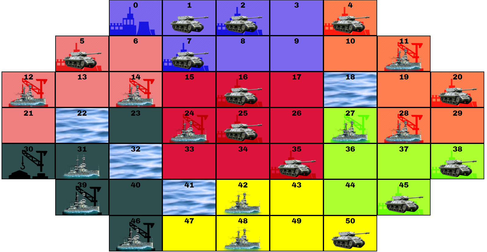
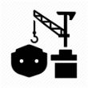
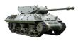

# Debellatio

## Overview
Debellatio is on online strategy board game for 2-7 players.

## How to Play

### The Board
The board is comprised of 50 territories each represented by a square on The board.

### Territories
There are 3 type of territories
1. Land - Most of the territories. Each land territory niegbors it adjacent territoris only (straign lines).
2. Coast - Territories surrounding sea territories in all dircetions (diagonal included).\
Coast territories neigbor their adjacent teritories and any digonal sea territory.
3. Sea - Blue territories marked with a wave pattern. Sea teritorries neigbor to their diagonal territories as well as their adjacent ones. Ther are no cities at sea. 

### Cities
Some of the territories are cities. they are marked with the city out line instead of a blank background.\
Controling cites is key to strengthing your army (see: Sprout \ Disband).\
There are 2 types of cities:
1. Industrial citeis - Can produce ground troops.\

2. Harbor cities - Can produce battle ships.\

### Troops
1. Ground troop - Can attack land and coast territories.\

2. Battle ship - Can attack sea and coast territories.\

### Seasons
Each year is comprised of 2-4 season. 
During the season player can discuss strategy and make deals with each other.
Once a player has decided on his actions for the season, he fills out the command sheet.

A season concludes when all players submit their commands sheets or when the allotted time has ended.

### Actions

### Sprout \ Disband

### How to Win
The first player to conquer 15 cities wins.

### Settings

* Spectator Mode - Sets the current device into spectator mode. This device will not be used by one of the player. Instead it can be connected to a T.V. or a large screen.

* Seasons Per Year - Determines how many seasons will be played in each year. Since sprouting new units only happens before the Fall season, playing 4 seasons a year makes the game more difficult.

* Maximum Number Of players - Maximum number of players allowed between 2 and 7. The game master may choose to start the game even if less player have joined the game.

* Season Length - How long will each season be (Minutes).

* First Season Length - How long will the first season be (Minutes). For new players we recommend double the length of a regular season.
