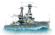

# Debellatio

## Overview
Debellatio is on online strategy board game for 2-7 players.

## How to Play

### The Board
The board is comprised of 50 territories each represented by a square on The board.

### Territories
There are 3 type of territories
1. Land - Most of the territories. Each land territory niegbors it adjacent territoris only (straign lines).
2. Coast - Territories surrounding sea territories in all dircetions (diagonal included).\
Coast territories neigbor their adjacent teritories and any digonal sea territory.
3. Sea - Blue territories marked with a wave pattern. Sea teritorries neigbor to their diagonal territories as well as their adjacent ones. Ther are no cities at sea. 

### Cities
Some of the territories are cities. they are marked with the city out line instead of a blank background.\
Controling cites is key to strengthing your army (see: Sprout \ Disband).\
There are 2 types of cities:
1. Industrial citeis - Can produce ground troops.\

2. Harbor cities - Can produce battle ships.\

### Troops
1. Ground troop - Can attack land and coast territories.\

2. Battle ship - Can attack sea and coast territories.\

### Seasons
Each year is comprised of 2-4 season. 
During the season player can discuss strategy and make deals with each other.
Once a player has decided on his actions for the season, he fills out the command sheet.

A season concludes when all players submit their command sheets or when the allotted time has ended.

### Actions
* Defend - The troop stays where it is and defends against enemies
* Attack - Troop attacks a neighboring territory (does not have to be occupied). 
* Assist - The troop assists a different troop (does not have to be of same army) to attack a neighboring territory. 
Use the first box to determine the attack target and the second to mark which troop you are assisting.
* Convoy - A ship that is currently at sea can convoy a ground troop from one coast to another. 
Use the first box to determine the attack target and the second to mark which troop you are convoying.
* Get Convoyed - A land troop can be convoyed over a body of water. In the command mention which ship will convoy the troop.

*Assisting\conveying unit whose own territory will be attacked will automatically shift from assisting\convoying to defending their own territory.

### resolving seasons
When a season is over all actions are resolved troop that had more troops attacking\assisting a territory than the territory had defending it will concor the territory. in case of a tie the defending units win.
If an attacking unit loses the attack and its origin territory has not been captured it will retreat to that territory.
If the origin territory has been captured the troop will be disbanded.

### Sprout \ Disband
Before the fall of every year, each army needs to match his troops to the amount of cities the army holds.
If the army holds more troops than cities the army will have to disband troops, or random troops will be disbanded for the army.
If an army has more cities than troops the army get to build new troops on any unoccupied territory under its control.

### How to Win
The first player to conquer 15 cities wins.

### Settings

* Spectator Mode - Sets the current device into spectator mode. This device will not be used by one of the player. Instead it can be connected to a T.V. or a large screen.

* Seasons Per Year - Determines how many seasons will be played in each year. Since sprouting new units only happens before the Fall season, playing 4 seasons a year makes the game more difficult.

* Maximum Number Of players - Maximum number of players allowed between 2 and 7. The game master may choose to start the game even if less player have joined the game.

* Season Length - How long will each season be (Minutes).

* First Season Length - How long will the first season be (Minutes). For new players we recommend double the length of a regular season.
